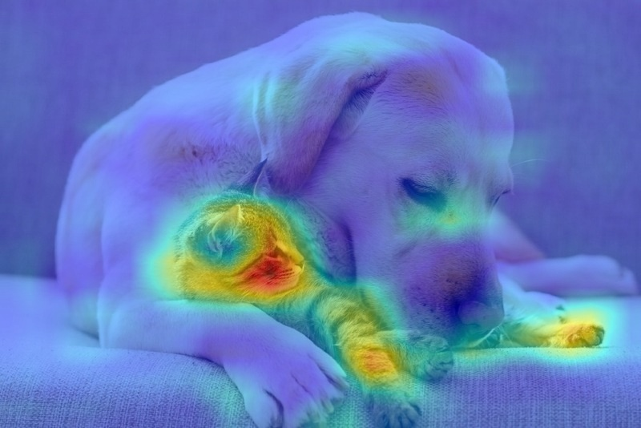

# CAM (Class Activation Map)

Implementation of the paper [Learning Deep Features for Discriminative Localization](https://arxiv.org/abs/1512.04150).

## Example

```bash
python3 cam.py  --image cat_and_dog.jpg --class-idx 208
```
Sample Input
------------


Sample Output
-------------




The class indices can be found at https://gist.github.com/yrevar/942d3a0ac09ec9e5eb3a

## Acknowledgement

Example image: cat_and_dog.jpg is by Cassandre Vingere (https://commons.wikimedia.org/wiki/File:Chien_avec_chat.pdf)
